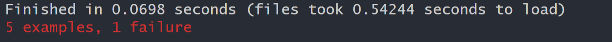

# Is It A?
#### *Created By: David Couch*
#### *Find out if a word is an anagram*
* * *

## Description
This is an app made to decipher wether your input value is an anagram or not.
  ##### What is an anagram?
  *  From [wikipedia]( https://en.wikipedia.org/wiki/Anagram )
  * This application is coded to give users a general idea and might not fallow strict anagram rules.
  ##### How about an Antigram?
  * In this app we are trying to find if there is _no_ matching letters as well. In this app we will refer to these at AntiGrams
* * *

## Technologies used
* Ruby `2.6.5`
* Rspec `3.10.0`
* pry `0.14.0`
* github
* * *

## Project Installation
* Ruby `2.6.5` is *required* to run this program.  
  * How to [install Ruby 2.6.5](https://www.learnhowtoprogram.com/ruby-and-rails/getting-started-with-ruby/installing-ruby).  

* Go to ( https://github.com/dcouch440/content-for-epicenter ).

* Navigate to the code button on the github website.

* Click on the code button to open the menu.

* Copy the HTTPS code by clicking the clipboard next to the link.

* Within your Bash terminal navigate to your desired location by using cd followed by your desired directory.

```bash
 cd Desktop
``` 

- Once you have chosen your desired directory use the command.

```bash 
git clone https://github.com/dcouch440/content-for-epicenter.git
```

<div 
  style="
    background-color: #d1ecf1; 
    color: grey; padding: 6px; 
    font-size: 9px; 
    border-radius: 5px; 
    border: 1px solid #d4ecf1; 
    margin-bottom: 12px"
> 
  <span 
    style="
      font-size: 12px; 
      font-weight: 600; 
      color: #0c5460;"
  >
    ⓘ
  </span>
  <span 
    style="
      font-size: 12px; 
      font-weight: 900; 
      color: #0c5460;
      margin-bottom: 24px"
  >
    Note : 
  </span> 
  If you have any problems make sure your HTTPS code is correct! The example above might not be the most recent HTTPS code!
</div>


* Then after the process is completed use the command.

``` bash
code .
```

* Then type

``` bash
gem install bundler

```
* then type

``` bash
bundle
```

* Then from the terminal you can run logical code through the terminal by typing 
```bash
lib/main.rb
```

* If you have any problems with that you can either try re setting the executable file by typing

```bash
chmod +x lib/main.rb
```

* Or
```bash
ruby lib/main.rb
```

* If there are any more concerns with scripting you can visit [this](https://www.learnhowtoprogram.com/ruby-and-rails/basic-ruby/basic-ruby-scripting#:~:text=We%20need%20to%20make%20the,the%20permissions%20for%20a%20file.) link for more details.

## Testing
* This project was created using **test-driven development** (TDD).

* To view the test suite, open anagram_spec.rb

* To run the test suite yourself and verify program functionality
  
```bash
rspec
``` 

* If there is a problem in the code the testing suite will read as such :

<div>
  
</div>

* Follow the examples and read the English that describes what the function should do (These are located in the test suites between quotes). If everything is in order you should receive back :

<div>
  
</div>

## Additional comments
* Created on 2/6/21

* * *

## Contact Information
_David Couch: [Email](dcouch440@gmail.com)_
* * *

## License
> [GPLv3](https://choosealicense.com/licenses/gpl-3.0/)\
> David Couch &copy; 2021

* * *
